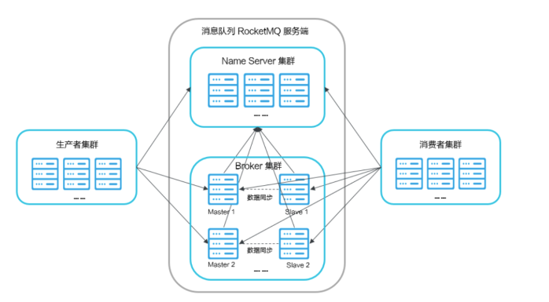
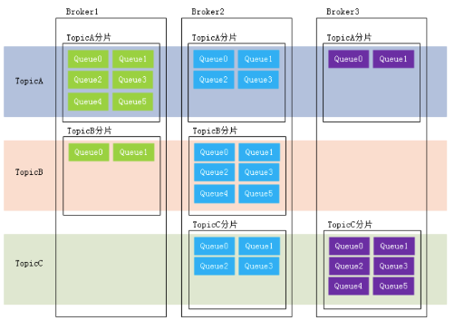
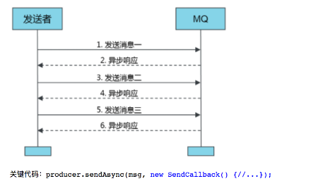

## RocketMq 问题

### 整体架构

1. nameServer： 
    - nameServer 路由消息的提供者，无状态节点，可以集群部署，节点之前没有信息同步。
    - 接收broker的请求，注册broker的路由信息
    - 接收client（producer/consumer）的请求，根据某个topic获取其到broker的路由信息
    - nameServer 没有状态，每个broker启动的时候会去 每个NameServer 进行注册其路由信息
2. broker：
    -消息中转角色，负责存储消息，转发消息
    - broker分为master 和 slave ，是1对多的关系
    - 每个broker和所有的nameServer建立长连接，定时注册Topic到NameServer，每隔30秒向所有的NameServer上报路由信息

### Topic Queue Tag 

+ Topic： 消息的第一级类型，比如一个电商系统，有交易消息，物流消息。
+ Queue： 主题被划分为一个或多个子主题，是一个主题在单个Broker上的分片，在分片的基础上在分为若干分，
+ consumer 在集群消费模式下，一个consumer仅仅消费topic中部分queue的消息，开启广播模式一个消息会被多个
consumer消费。

+ Tag： ags是Topic下的次级消息类型/二级类型（注：Tags也支持TagA || TagB这样的表达式），可以在同一个Topic下基于Tags进行消息过滤。
Tags的过滤需要经过两次比对，首先会在Broker端通过Tag hashcode进行一次比对过滤，匹配成功传到consumer端后再对具体Tags进行比对，
以防止Tag hashcode重复的情况。比如交易消息又可以分为：交易创建消息，交易完成消息.....
 一条消息可以没有Tag。RocketMQ提供2级消息分类，方便大家灵活控制。标签，换句话说，为用户提供了额外的灵活性。
 有了标签，来自同一个业务模块的不同目的的消息可能具有相同的主题和不同的标签。标签将有助于保持您的代码干净和连贯，
 并且标签还可以为RocketMQ提供的查询系统提供帮助。

### Producer 与 Producer Group

+ RocketMQ提供了发送：普通消息（同步、异步和单向（one-way）消息）、定时消息、延时消息、事务消息。
+ Producer Group是一类Producer的集合名称，这类Producer通常发送一类消息，
且发送逻辑一致。相同角色的生产者被分组在一起。同一生产者组的另一个生产者实例可能被broker联系，
以提交或回滚事务，以防原始生产者在交易后崩溃。

### Consumer 与 Consumer Group
+ Push Consumer：Consumer 的一种，应用通常向 Consumer 对象注册一个 Listener 接口，一旦收到消息，
Consumer 对象立刻回调 Listener 接口方
+ Pull Consumer：　Consumer 的一种，应用通常主动调用 Consumer 的拉消息方法从 Broker 拉消息，主动权由应用控制。
+ Consumer Group：Consumer Group是一类Consumer的集合名称，这类Consumer通常消费一类消息，
且消费逻辑一致(使用相同 Group ID 的订阅者属于同一个集群。
同一个集群下的订阅者消费逻辑必须完全一致（包括 Tag 的使用），这些订阅者在逻辑上可以认为是一个消费节点)。消费者群体是　
一个伟大的概念，它实现了负载平衡和容错的目标，在信息消费方面，是非常容易的。

### 消息的种类

+ 同步消息
+ 异步消息
+ 单项消息
+ 事务消息

    1  > 同步是指消息发送方发出数据后，会阻塞到MQ返回响应消息，用于重要短信，报名通知登  
    2  > 异步是指发送方发出数据之后，不等待回应，需要用户实现异步回调接口，并对服务响应进行处理。
    
    3  > 单向消息只负责发送消息，不负责对响应进行处理，适用于耗时非常短，可靠性要求不高的场景。
    
    

